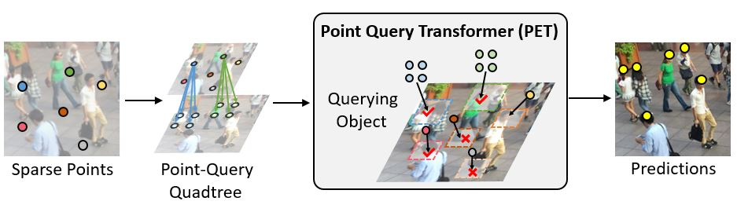
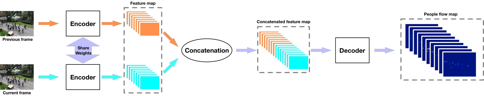

# Video-crowd-counting-11HUST

This is the repository of the "Consistent pedestrian counting in time and space" project of the 11th team. This repository contains 4 parts of our work: the WuhanMetro dataset, the PET(Point-Query Quadtree) method for single-frame crowd counting, the FRVCC(Frame-Recurrent Video Crowd Counting) method for video crowd counting(to be explored later), and the PeopleFlows method for video crowd counting.

The original repository of PET is [here](https://github.com/cxliu0/PET), and the original repository of PeopleFlows is [here](https://github.com/weizheliu/People-Flows). Because of the absence of the official code of FRVCC, we will provide the code of FRVCC coded by ourselves according to [the paper of FRVCC](https://ieeexplore.ieee.org/document/10057072), which could'nt perform as requested. Additional work on FRVCC is welcomed.

## Introduction of WuhanMetro Dataset

<p align="center">
    
</p>

The WuhanMetro dataset is a dataset of pedestrian counting in the Wuhan Metro. The dataset includes **frames cut from 6 videos, 2145 frames in total, both 5/0.5 fps**, and the corresponding ground truth of the location of pedestrians in each frame. The dataset is used to fine-tune the model of PET, train the PeopleFlows model and evaluate the performance of PET and PeopleFlows.

The characteristics of the frames are diverse, including scenes of **dense/sparse, clear/blurry**, etc. They guarantee the robustness of the model.

There are 3 types of annotations, including *Inflow*, *Outflow* and *Pedestrain*, standing for the inflow of pedestrians, the outflow of pedestrians and the remaining pedestrians in the frame, respectively. The annotations are stored in the format of `json`.

## Usage of PET on the WuhanMetro Dataset

<p align="center">
    
</p>

### Installation

- Required packages:
  
```
torch
torchvision
numpy
opencv-python
scipy
matplotlib
```

- Install packages:

```
pip install -r requirements.txt
```

### Training

- Download ImageNet pretrained [vgg16_bn](https://download.pytorch.org/models/vgg16_bn-6c64b313.pth), or you can download [CroHD pretrained VGG backbone](https://pan.baidu.com/s/151HiN_b8mfy8cccC0lYPew?pwd=uosg) which can achive better results - and put them in ```pretrained``` folder. Or you can define your pre-trained model path in [models/backbones/vgg.py](PET/models/backbones/vgg.py)
- CroHD dataset can be downloaded from [here](https://motchallenge.net/data/Head_Tracking_21/)
- To train PET on your dataset, run
  
  ```
  sh train.sh
  ```

### Evaluation

- Modify [eval.sh](PET/eval.sh)
  - change ```--resume``` to your local model path
- Run

```
sh eval.sh
```

### Pretrained Models

- Environment:
```
python==3.8
pytorch==1.12.1
torchvision==0.13.1
```

- Models:

Notifications: The metric NMAE is used to better evaluate the performance of the model. The lower the NMAE, the better the performance.

| Dataset used to train the model    | Model Link | MAE | MSE | NMAE(*1e-2) |
| ------------------------ | ----------- | --------------| --------------| --------------|
| ShanghaiTech PartA       |  [SHA_model.pth](https://drive.google.com/file/d/1QwV8hrEDs1LQ4h1TH4KSL8tB51AImNMT/view?usp=drive_link)   | 7.23 | 8.36 | 33.49 |
| ShanghaiTech PartB       |  [SHB_model.pth](https://drive.google.com/file/d/10HK42xC6fmOK-5lQfu-pTn6oAHYeRUhv/view?usp=sharing)   | 4.70 | 5.65 | 22.40 |
| ImageNet+WuhanMetro         |  [ImageNet+WM.pth](https://pan.baidu.com/s/11ThBXqnd3RR4iV1FpJyZnw?pwd=a524)   | 4.78 | 6.06 | 21.21 |
| CroHD+WuhanMetro      |  [Cro+WM.pth](https://pan.baidu.com/s/115sgCqYeDqZVCHYhu4GTzw?pwd=gizv)   | **3.55** | **4.43** | **17.44** |

## Usage of PeopleFlows on the WuhanMetro Dataset

<p align="center">
    
</p>

### Installation

PyTorch 1.3.1
Python 3.7.4

### Training

In command line:

```
python train.py train.json val.json
``` 

The details of the training process can be found in the [PeopleFlows repository](https://github.com/weizheliu/People-Flows).

### Testing

&emsp;1. Modify the "test.py", make sure the path is correct.

&emsp;2. In command line:

```
python test.py
``` 

### Visualization

&emsp;1. Modify the "plot.py", make sure the path is correct.

&emsp;2. In command line:

```
python plot.py
``` 
This will plot the flows of each direction along with the density map.

### Pre-trained Model

The pretrained model is [here](https://pan.baidu.com/s/18m7wMFEeXeNg--gj8JPgcA?pwd=u6k5), and the model is trained on the WuhanMetro dataset.

## Results

For more accurate evaluation on time-space coherence performence on WuhanMetro, the VoNE metric is used to evaluate the performance of the models. The lower the VoNE, the better the performance. VoNE is calculated by the following formula:
```math
\begin{gathered}
Err_i=\frac{z_i-\hat{z_i}}{GT_i} \\
\begin{aligned}\overline{Err}=\frac{1}{N}\sum_{i=1}^{N}Err_i\end{aligned} \\
\begin{aligned}VoNE=\frac{1}{N}\sum_{i=1}^{N}(Err_i-\overline{Err})^2\end{aligned} 
\end{gathered}$$
```

The results of the PET model and the PeopleFlows model tested on the WuhanMetro dataset are shown below:

| Model | MAE | NMAE(*1e-2) | VoNE(*1e-2) |
| --- | --- | --- | --- |
| PET on SHA | 7.23 | 33.49 | 13.55 |
| PET on SHB | 4.70 | 22.40 | 6.77 |
| PET on ImageNet+WM | 4.78 | 21.21 | 6.24 |
| PET on CroHD+WM | <u>3.55</u> | <u>17.44</u> | <u>5.00</u> |
| PeopleFlows | **2.97** | **13.33** | **2.67** |

## Statement

- Some parts of the code in the FRVCC make use of the code in the **PWCNet** repository, which is [here](https://github.com/sniklaus/pytorch-pwc). **The PWCNet is used to generate the optical flow between frames in the FRVCC model.**

- The code in this repository is only used for academic research and personal practice. If you find this work or code useful for your research, please cite the original papers and repositories of PET, FRVCC and PeopleFlows. Thank you for your attention.
